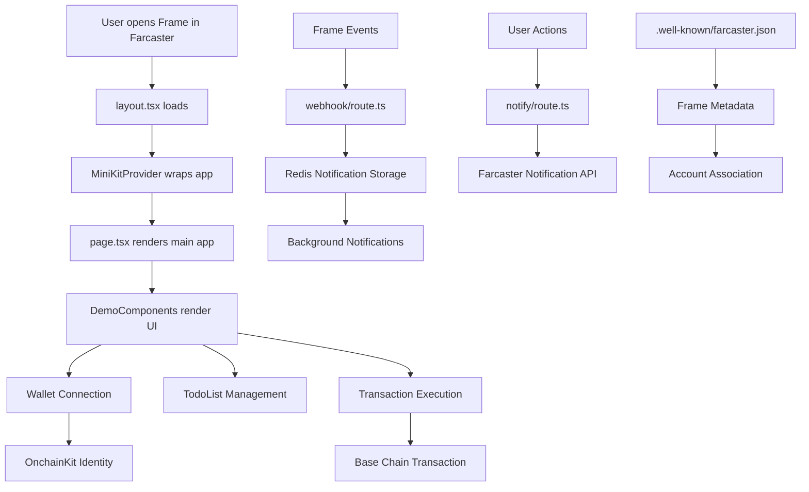

# Hola Ultra Mundo - MiniKit Template Code Review

## Project Overview

**Hola Ultra Mundo** is a Next.js-based MiniKit template designed for building Farcaster Frame applications. It's configured with OnchainKit, enabling blockchain interactions and frame functionality within the Farcaster ecosystem.

## Technology Stack

- **Framework**: Next.js 15.3.3 (App Router)
- **Language**: TypeScript
- **Styling**: Tailwind CSS with custom CSS variables
- **Blockchain**: OnchainKit, Wagmi, Viem (Base chain)
- **Frame SDK**: Farcaster Frame SDK
- **Database**: Upstash Redis for notifications
- **UI Components**: Custom components with OnchainKit integration

## Project Structure

```
/home/sandusky/repos/ultra-mini-apps/hola-ultra-mundo/
├── app/                           # Next.js App Router
│   ├── .well-known/              # Farcaster configuration
│   │   └── farcaster.json/route.ts
│   ├── api/                      # API endpoints
│   │   ├── notify/route.ts       # Notification API
│   │   └── webhook/route.ts      # Webhook handler
│   ├── components/               # React components
│   │   └── DemoComponents.tsx    # Main UI components
│   ├── globals.css               # Global styles
│   ├── layout.tsx               # Root layout with metadata
│   ├── page.tsx                 # Main app page
│   ├── providers.tsx            # Context providers
│   └── theme.css                # Custom theme variables
├── lib/                         # Utility libraries
│   ├── notification-client.ts   # Notification utilities
│   ├── notification.ts          # Redis notification handlers
│   └── redis.ts                 # Redis configuration
├── public/                      # Static assets
│   ├── hero.png, icon.png, etc. # App images
└── Configuration files...
```

## Core Components Analysis

### 1. Layout & Providers (`app/layout.tsx`, `app/providers.tsx`)

**Purpose**: Sets up the application foundation with metadata and context providers.

**Key Features**:
- Frame metadata configuration for Farcaster embedding
- MiniKitProvider wraps the entire app with OnchainKit integration
- Auto theme mode and Base chain configuration
- Safe area insets for mobile compatibility

### 2. Main Application (`app/page.tsx`)

**Purpose**: Primary application logic and state management.

**Key Features**:
- MiniKit integration with frame readiness detection
- Wallet connection with OnchainKit components
- Tab-based navigation (Home/Features)
- Frame addition functionality with user feedback
- Identity display (Name, Avatar, Address, ETH Balance)

### 3. Demo Components (`app/components/DemoComponents.tsx`)

**Purpose**: Comprehensive UI component library demonstrating MiniKit capabilities.

**Components Include**:

#### `Button` Component
- Multiple variants: primary, secondary, outline, ghost
- Size options: sm, md, lg
- Icon support and disabled states
- CSS variable-based theming

#### `Card` Component
- Glass-morphism design with backdrop blur
- Optional title sections
- Hover animations and click handling
- Keyboard accessibility

#### `Home` Component
- Welcome card with feature exploration
- TodoList integration
- TransactionCard for blockchain interactions

#### `Features` Component
- Feature showcase with checkmark icons
- Lists key app capabilities
- Navigation back to home

#### `Icon` Component
- SVG icon system (heart, star, check, plus, arrow-right)
- Scalable sizing system
- Accessible with proper ARIA labels

#### `TodoList` Component
- Interactive task management
- Add, toggle, and delete functionality
- Local state management with useState
- Keyboard navigation support

#### `TransactionCard` Component
- OnchainKit Transaction integration
- Sponsored transaction capability
- Success notification handling
- Wallet connection requirement

### 4. Theme System (`app/theme.css`)

**Purpose**: Comprehensive theming with dark/light mode support.

**Features**:
- CSS custom properties for consistent theming
- Automatic dark mode detection
- OnchainKit variable mapping
- Geist font integration
- Custom animations (fade-in, fade-out)

### 5. API Endpoints

#### Notification API (`app/api/notify/route.ts`)
- Sends frame notifications to users
- Integrates with notification client utilities
- Error handling and response formatting

#### Webhook API (`app/api/webhook/route.ts`)
- Handles Farcaster frame lifecycle events
- FID ownership verification using Key Registry
- Event types: frame_added, frame_removed, notifications_enabled/disabled
- Welcome notifications for new users

### 6. Utility Libraries

#### Notification Client (`lib/notification-client.ts`)
- Frame notification sending functionality
- Rate limiting and error handling
- Integration with Farcaster notification system

#### Notification Storage (`lib/notification.ts`)
- Redis-based user notification details storage
- CRUD operations for notification preferences
- Scoped keys by project name

#### Redis Configuration (`lib/redis.ts`)
- Upstash Redis client setup
- Environment variable validation
- Graceful degradation when Redis unavailable

### 7. Farcaster Integration (`app/.well-known/farcaster.json/route.ts`)

**Purpose**: Farcaster Frame metadata and account association configuration.

**Features**:
- Account association for frame installation
- Frame metadata (name, description, icons, URLs)
- Webhook URL configuration
- Property validation and filtering

## Key Features

### 1. **Frame Integration**
- Seamless Farcaster Frame embedding
- Account association for user installations
- Frame lifecycle event handling
- Webhook-based notifications

### 2. **Blockchain Functionality**
- Base chain integration via OnchainKit
- Sponsored transactions (gasless for users)
- Wallet connection and identity management
- ETH balance display

### 3. **Notification System**
- Background notifications via Redis storage
- User preference management
- Welcome notifications for new users
- Rate limiting and error handling

### 4. **Responsive Design**
- Mobile-first approach with safe area insets
- Dark/light mode automatic detection
- Glass-morphism design language
- Smooth animations and transitions

### 5. **Developer Experience**
- TypeScript for type safety
- Modular component architecture
- Environment-based configuration
- Comprehensive error handling

## Architecture Flow



## Component Relationships

### Data Flow:
1. **MiniKitProvider** → Provides OnchainKit context and Base chain configuration
2. **App Component** → Manages frame state, wallet connection, and tab navigation
3. **DemoComponents** → Handle UI interactions and blockchain transactions
4. **API Routes** → Process webhooks and notifications
5. **Redis Storage** → Persists user notification preferences

### State Management:
- **Local State**: TodoList, activeTab, frameAdded status
- **Context State**: MiniKit frame context, wallet connection
- **External State**: Redis for notifications, blockchain for transactions

## Environment Configuration

The application requires several environment variables for full functionality:

### Core Variables:
- `NEXT_PUBLIC_ONCHAINKIT_API_KEY` - OnchainKit API access
- `NEXT_PUBLIC_URL` - Application URL for frame metadata
- `NEXT_PUBLIC_ONCHAINKIT_PROJECT_NAME` - App name

### Frame Configuration:
- `FARCASTER_HEADER/PAYLOAD/SIGNATURE` - Account association
- `NEXT_PUBLIC_APP_*` - Frame metadata (icon, description, images)

### Notification System:
- `REDIS_URL` and `REDIS_TOKEN` - Upstash Redis for notifications

## Development Recommendations

### For Customization:
1. **Remove Demo Components**: Delete `DemoComponents.tsx` and related imports
2. **Update Branding**: Modify theme variables in `theme.css`
3. **Add Features**: Extend components with new functionality
4. **Configure Environment**: Set up all required environment variables

### For Production:
1. **Security**: Ensure proper environment variable handling
2. **Error Handling**: Add comprehensive error boundaries
3. **Performance**: Optimize images and implement code splitting
4. **Testing**: Add unit and integration tests

This codebase provides a solid foundation for building Farcaster Frame applications with blockchain integration, featuring a modern React architecture, comprehensive theming system, and robust notification infrastructure.
